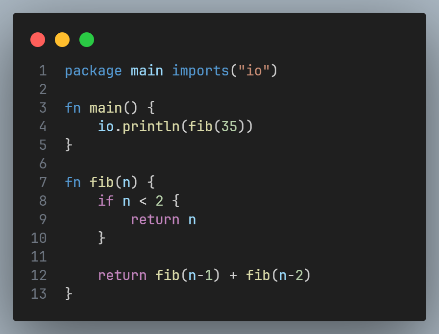
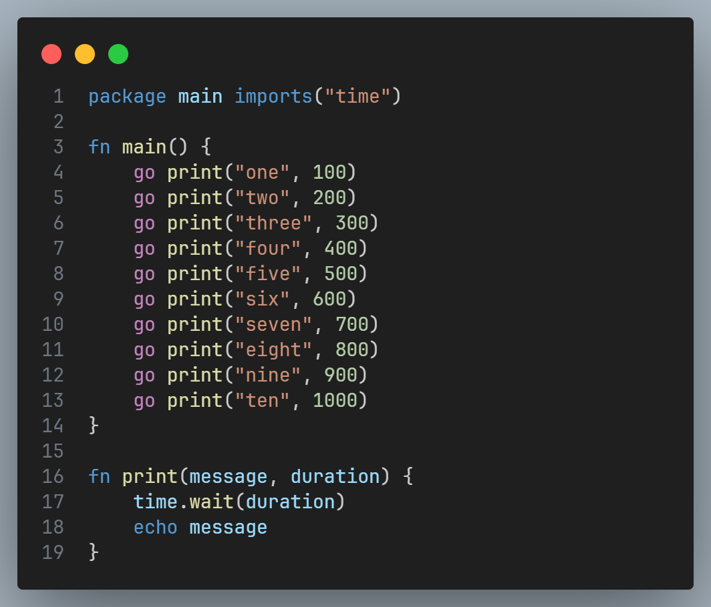

# The Evie Programming Language

Evie is a dynamically typed programming language written in Go. The goal is to provide Go developers with a blazingly fast embeddable scripting language that does *not* depend on CGO. Preliminary micro-benchmarks show Evie to be faster than PUC [Lua 5.4.2](https://lua.org/)  and also Google's [V8 Ignition](https://v8.dev/docs/ignition) JavaScript interpreter. See [here](#benchmarks).

## Showcase
#### Here is some example code from [examples/fib.ev](./examples/fib.ev)
<a href="./examples/fib.ev">
    
</a>

#### Here is a string interpolation example from [examples/input.ev](./examples/input.ev)
<a href="./examples/input.ev">
    
</a>

#### Also a concurrency example from [examples/go.ev](./examples/go.ev)
<a href="./examples/go.ev">
    
</a>

To test this exact program, run `go run ./cli -t ./examples/go.ev`. Then remove all of the `go` keywords infront of the `print` calls and re-run to see the difference. This is still single threaded by the way. It is concurrent yes. But single threaded and safe. The `go` keyword just schedules it for execution, but they only run when `main` returns or yields via `await`. You can say Evie by default has a [GIL](https://en.wikipedia.org/wiki/Global_interpreter_lock) (Global Interpreter Lock).

> The flag `-t` prints the execution time of just Evie, i.e. total time `-` the time it took to compile Evie itself. You could alternatively build Evie first by doing `go build ./cli`, as shown at the bottom of this page.

> Also you need Go installed of course. But don't worry as it is probably the simplest language to setup. See [here](https://go.dev/doc/install).

#### What about true parallelism?
I did not want to make the same mistake as Python. That is, not providing a means to do true multi-threading by default. So here it is, [examples/unsynced.ev](./examples/unsynced.ev).

<a href="./examples/unsynced.ev">
    
</a>

## Goals
- Highly performant
- Builtin concurrency
- Very similar to existing languages
- Easily embeddable
- Provide a standalone mode for non-embedded use
- No CGO

> This language is in an early state. I have been hard at work optimising and improving the core language. The standard library only contains some basic methods for testing purposes.

## Docs
- [Language Syntax](https://github.com/hxkhan/evie/tree/main/docs/syntax.md)

## Features checklist
- Package management ⏳
- Variables ✅
- Functions ✅
- Primative types (`number` `bool` `nil`) ✅
- Reference types (`string` `function`) ✅
- Control flow (`if` `else`) ✅
- Control flow (`switch` `while`) ✅
- Control flow (`for`) ❌
- Control flow (`break` `continue`) ✅
- Operators (`+` `-` `*` `/` `%` `==` `<` `>`) ✅
- Concurrency (basics work but needs *polishing*) ⏳
- Scoping (global, function, block) ✅
- Error handling (exceptions) ⏳
- Interoperability (call into Go) ✅

## Benchmarks
| Language | fib(35)  | Host Language |
| :-       | :-       | :-            |
| [**Evie**](https://github.com/hxkhan/evie) | `396ms` | Go |
| [Lua 5.4.2](https://lua.org/) | `536ms` | C | 
| [JS - V8 Ignition](https://v8.dev/docs/ignition) | `665ms` | C++ | 
| [JS - QuickJS](https://bellard.org/quickjs/) | `703ms` | C | 
| [Python 3.13](https://python.org/) | `826ms` | C |
| [Wren](https://wren.io/) | `893ms` | C |
| [Tengo](https://github.com/d5/tengo) | `1603ms` | Go |

> These benchmarks were ran on an Intel i5-13400F. Each language 10 times and the average was taken.

Why `fib(35)`? Because Evie barely has a standard library so micro-benchmarks is all I rely on. And also because `fib(35)` does measure:
- Function calls (invocation) overhead as it does `29860703` of them afterall 
- Instruction dispatch overhead
- Number crunching (primative math)
- Conditional logic

# Setup
All of these exist in the [examples](./examples) directory. To build the evie cli you can do:
1. First install go from [here](https://go.dev/doc/install)
2. Then git clone this repo
3. Build the standalone cli
4. Use it like any other language
```
git clone https://github.com/hxkhan/evie.git
cd evie
go build ./cli
time ./cli ./examples/fib.ev
```

To benchmark the other languages, you can grab your own versions from their respective websites. For example; if you have python installed then just do `time python ./examples/fib.py`, you might have to change `python` for `python3`.

The easiest way to test [V8's Ignition](https://v8.dev/docs/ignition) interpreter is to have [nodejs](https://nodejs.org/en) installed and then run `time node --jitless --no-expose_wasm ./examples/fib.js`. The `--jitless` disables the JIT compiler. The `--no-expose_wasm` has to be done alongside becuase wasm depends on the JIT.

> Keep in mind, `time` exists only on linux, use `Measure-Command` on Windows powershell like `Measure-Command { python ./examples/fib.py }`
